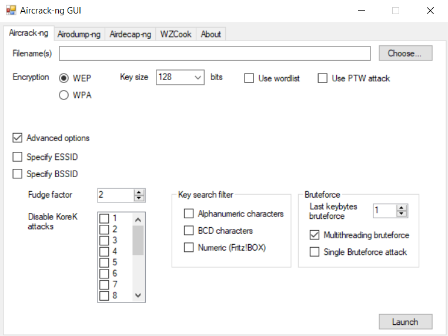

#### *Báo cáo Project 2*
# CRACKING WEP
**Nguyễn Thị Hồng Phúc - 17520128**/**Lê Trần Anh Thư - 17520169**
## Mục lục
### [I.	Thiết bị](#thietbi)
### [II.	Cracking WEP](#crackingWEP)
  * [1.	Lỗ hổng của WEP](#lohongWEP)
  * [2. Kismet, Aireplay-ng, Airodump-ng, Aircarck-ng](#Linux)
  * [3.	CommView for WiFi](#Windows)

## I. Thiết bị
-	Access Point: Totolink N302R Plus
-	Operation System: Kali Linux 2020.2
-	CPU core: i5
-	CPU Speed: 250 GHz
-	RAM: 16GB
-	Wireless Card: Intel(R) Dual Band Wireless-AC 8265

## II. Cracking WEP

### 1. Lỗ hổng của WEP
WEP sử dụng RC4 (stream cipher). Nên để đảm bảo hai plaintext giống nhau sẽ luôn cho ra hai ciphertext khác nhau trong những lần encrypt khác nhau, một IV dài 24 bits được tạo ra, cộng thêm với key để encrypt plaintext. Sau đó IV dưới dạng plaintext sẽ được gửi kèm với ciphertext cho người nhận.

Với độ dài 24 bit, số IV có thể được tạo ra dao động trong khoảng 16.777.216 trường hợp. Từ việc bắt được 1 số lượng IVs đủ lớn, cũng như lợi dụng lỗ hổng từ RC4, hacker có thể tiến hành phân tích IVs, dò ra được đoạn ciphertext, từ đó bẻ khóa được password WEP.

### 2. Kismet, Aireplay-ng, Airodump-ng, Aircarck-ng
#### *Step 1: Đặt vào chế độ Monitor*
Kiểm tra Kali Linux nhận wireless card bằng câu lệnh **iwconfig**, tại đây ta thấy wlan0 sẽ là interface của wireless adapter.
Chạy lệnh airmon-ng start wlan0 để bật chế độ monitor cho wlan0.
Chạy lệnh **ifconfig wlan0mon** ta sẽ thấy một interface mới, wlan0mon là interface dùng để sniff các packet wireless, lúc này card mạng sẽ thu nhận tất cả các packets được gửi đi từ các card wireless khác trong phạm vi bắt sóng.

#### *Step 2: Kismet – Network Sniffer*
Kismet sử dụng card mạng không dây (wireless network card) đặt ở chế độ monitor để âm thầm quét tất cả các kênh Wi-fi trong khu vực xung quanh. Bằng cách giải mã và kết hợp dữ liệu,  Kismet trực quan hóa các mạng trong khu vực xung quanh, cũng như hoạt động của các thiết bị được kết nối với các mạng trong khu vực đó.
Để chạy Kismet, ta nhập câu lệnh **kismet -c wlan0**. Màn hình terminal sẽ hiển thị đường dẫn để truy cập vào giao diện GUI của Kismet.

Bắt đầu thu thập thông tin về mạng Wifi cần tấn công. Kismet có thể thu thập các thông tin cụ thể như: SSID, địa chỉ MAC, loại thiết bị (Wi-Fi AP, Wi-Fi client, …), tần số, kênh. Trong đó, SSID, địa chỉ MAC, loại bảo mật Wi-Fi và số kênh là các thông số cần chú ý.
Ở đây, Access Point cần crack có SSID là “InSecLab”,  loại bảo mật là WEP, địa chỉ MAC là “B8:55:10:CA:6E:FA” và số kênh là 11.

Có thể thu thêm nhiều thông tin của Access Point này bằng cách click vào và đọc thông tin ở mục “Device Info” và “Wi-Fi 801.11”.

Mục Associated Clients biểu thị các thiệt bị đang truy cập vào AP tại thời diểm quét, cụ thể sẽ có nội dung như sau:

Ngoài Kismet, có thể bắt các gói tin ở các mạng không dây xung quanh bằng câu lệnh **airodump-ng wlan0mon**. Tuy nhiên, airodump-ng chỉ cung cấp các thông số cơ bản. Các thông tin được hiển thị tương tự như hình bên dưới:

#### *Step 3: Airodump-ng – Grabbing IVs*
Thực hiện bắt các gói tin trên Access Point cụ thể bằng câu lệnh ``airodump-ng --bssid B8:55:10:CA:6E:FA -c 11 -w WEPcrack wlan0mon``

Trong đó:
- **--bssid B8:55:10:CA:6E:FA**: Địa chỉ MAC của AP
-	**-c 11**: Channel mà AP phát sóng
-	**-w WEPcrack**: xuất ra file WEPcrack.cap
-	**wlan0mon**: tên card wifi ở chế độ monitor

Sau khi chạy câu lệnh trên, airodump-ng sẽ xuất ra các file  *“.csv”* (CSV file), *“.kismet.csv”* (Kismet CSV file) và *“.kismet.netxml”* (Kismet newcore netxml file) chứa thông tin về các Access Point và client.

#### *Step 4: Aireplay-ng*
Dùng aireplay để tiêm thêm các gói ARP vào Access Point, đẩy nhanh việc thu thập IVs.
Có 2 cách:
- *C1.1*: Fake Authentication Attack => Gửi các gói authentication giả đến Access Point.
- *C1.2*: ARP Injection => Tiêm vào Access Point các gói tin bất kỳ.

- *C2*: Interactive Packet Replay => Thực hiện resend các gói data từ client đến Access Point.

Trong phần này, nhóm em dùng phương pháp **Interactive Packet Replay** để tiêm vào Access Point với câu lệnh 
``aireplay-ng -2 -b [AP MAC] -h [Client MAC] -n 100 -p 0841 -c FF:FF:FF:FF:FF:FF wlan0mon``.

Trong đó:
- **-2**: interactive replay attack
-	**-b [AP MAC]**: địa chỉ MAC của Access Point
-	**-h [Client MAC]**: địa chỉ MAC của client mục tiêu
-	**-n 100**: chiều dài giới hạn của gói tin
-	**-p 0841**: đặt Frame Control sao cho gói tin gửi đi trông giống được gửi từ máy khách đến Access Point
-	**-c FF:FF:FF:FF:FF:FF**: đặt địa chỉ MAC đích là broadcast, gây ra việc replay packet ở Access Point => thu được thêm IV
-	**wlan0mon**: interface trong chế độ monitor

#### *Step 5: Aircrack-ng*
Dùng câu lệnh ``aircrack-ng WEPcrack-01.cap`` để phân tích tích IVs trong file  WEPcrack-01.cap. Nếu lượng IVs thu được chưa đủ để phân tích, khi chạy file WEPcrack-01.cap sẽ có thông báo failed, hiển thị số lượng IVs đã thu thập và số lượng IVs cần thêm.

Khi đã thu được đủ IVs, aircrack sẽ phân tích và cho ra kết quả là password của Wi-Fi InSecLab.
Password crack lần 1: @bcd7.

Password crack lần 2:  6$Dw0

### 3. CommView for WiFi:
CommView for WiFi là phần mềm giám sát dữ liệu tuyển tải qua mạng không dây, phân tích chi tiết các giao thức phổ biến, giải mã thành lớp (layer) cơ bản.

Sau khi khởi động CommView, phần mềm sẽ tự động đưa card mạng của máy vào chế độ monitor.

Đầu tiên chọn “Scanner mode -> Configure -> Start Capture” để dò tất cả các mạng không dây trọng khu vực, khi tìm thấy được mạng không dây cần sniffing, chú ý đến số channel.

Sau đó tại mục Captue, chọn *Single channel mode -> Channel x*. Trong phần này, mạng Wi-Fi “InSecLab” ở channel 12. Bắt đầu bắt các gói tin trong mạng này.

Việc bắt gói tin kết thúc, chọn *File -> Log Viewer -> Load CommView Log*, chọn các file log vừa capture được lưu trong thư mục Log của phần mềm. Chọn *File -> Export pcap* để xuất ra file pcap.

Nếu thực hiện trên Windows có thể cài đặt bản Aircrack-ng GUI để thực hiện việc phân tích gói pcap và crack password. Aircrack-ng GUI có giao diện như sau.

Tuy nhiên trong phần này, nhóm em dùng aircrack-ng có sẵn ở máy ảo Kali Linux 2020.1. Chạy file .cap -> chọn gói tin thứ 2 (WEP).
Key là ASCII 40 bit: X(w8o

#### **Tham khảo**
- https://www.aircrack-ng.org/doku.php?id=simple_wep_crack
- https://null-byte.wonderhowto.com/how-to/hack-wi-fi-cracking-wep-passwords-with-aircrack-ng-0147340/
- https://www.youtube.com/watch?v=xka54tG2Kqo
- https://writingthroughdawn.wordpress.com/2013/11/23/wardriving-101-a-simple-tutorial/
