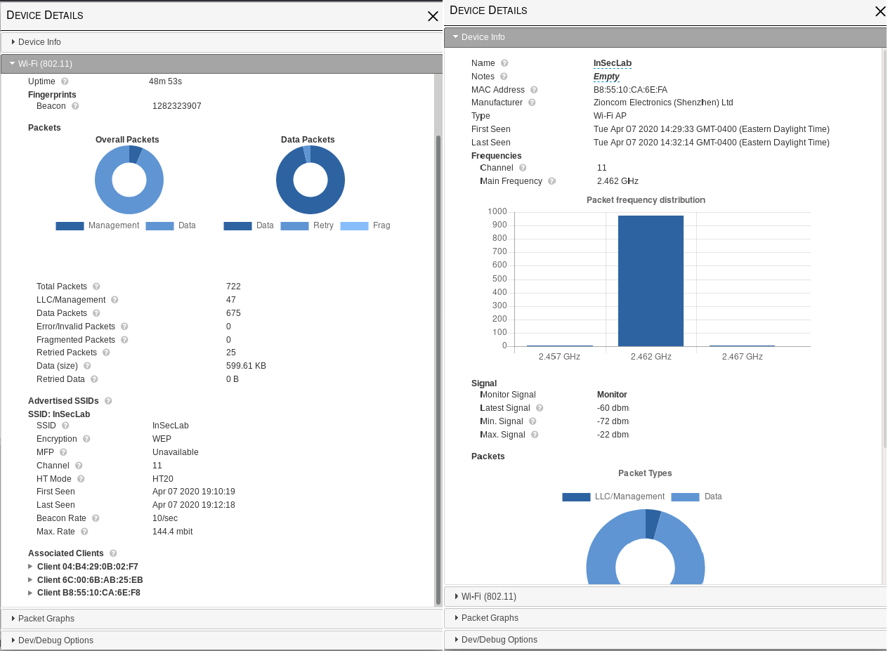

### *Báo cáo Project 2*
# CRACKING WEP
### Mục lục
 [I.	Thiết bị](#thietbi)

 [II.	Cracking WEP](#crackingwep)
- [1.	Lỗ hổng của WEP](#LohongcuaWEP)
- [2. Cracking WEP (Kismet, Aireplay-ng, Airodump-ng, Aircarck-ng)](#crackingwep)
- [3.	CommView for WiFi](#CommView)

## I. Thiết bị
-	Access Point: Totolink N302R Plus
-	Operation System: Kali Linux 2020.2
-	CPU core: i5
-	CPU Speed: 250 GHz
-	RAM: 16GB
-	Wireless Card: Intel(R) Dual Band Wireless-AC 8265

## II. Cracking WEP
### 1. Lỗ hổng của WEP
- WEP sử dụng RC4 (stream cipher). Nên để đảm bảo hai plaintext giống nhau sẽ luôn cho ra hai ciphertext khác nhau trong những lần encrypt khác nhau, một IV dài 24 bits được tạo ra, cộng thêm với key để encrypt plaintext. Sau đó IV dưới dạng plaintext sẽ được gửi kèm với ciphertext cho người nhận.
-	Với độ dài 24 bit, số IV có thể được tạo ra dao động trong khoảng 16.777.216 trường hợp. Từ việc bắt được 1 số lượng IVs đủ lớn, cũng như lợi dụng lỗ hổng từ RC4, hacker có thể tiến hành phân tích IVs, dò ra được đoạn ciphertext, từ đó bẻ khóa được password WEP.

### 2. Cracking WEP (Kismet, Aireplay-ng, Airodump-ng, Aircarck-ng)
#### *Step 1: Đặt vào chế độ Monitor*
-	Kiểm tra Kali Linux nhận wireless card bằng câu lệnh iwconfig, tại đây ta thấy wlan0 sẽ là interface của wireless adapter.
-	Chạy lệnh airmon-ng start wlan0 để bật chế độ monitor cho wlan0.
-	Chạy lệnh ifconfig wlan0mon ta sẽ thấy một interface mới, wlan0mon là in-terface dùng để sniff các packet wireless, lúc này card mạng sẽ thu nhận tất cả các packets được gửi đi từ các card wireless khác trong phạm vi bắt sóng.

#### *Step 2: Kismet – Network Sniffer*
-	Kismet sử dụng card mạng không dây (wireless network card) đặt ở chế độ monitor để âm thầm quét tất cả các kênh Wi-fi trong khu vực xung quanh. Bằng cách giải mã và kết hợp dữ liệu,  Kismet trực quan hóa các mạng trong khu vực xung quanh, cũng như hoạt động của các thiết bị được kết nối với các mạng trong khu vực đó.
-	Để chạy Kismet, ta nhập câu lệnh **kismet -c wlan0**. Màn hình terminal sẽ hiển thị đường dẫn để truy cập vào giao diện GUI của Kismet.

-	Bắt đầu thu thập thông tin về mạng Wifi cần tấn công. Kismet có thể thu thập các thông tin cụ thể như: SSID, địa chỉ MAC, loại thiết bị (Wi-Fi AP, Wi-Fi client, …), tần số, kênh. Trong đó, SSID, địa chỉ MAC, loại bảo mật Wi-Fi và số kênh là các thông số cần chú ý.
-	Ở đây, Access Point cần crack có SSID là “InSecLab”,  loại bảo mật là WEP, địa chỉ MAC là “B8:55:10:CA:6E:FA” và số kênh là 11.

-	Có thể thu thêm nhiều thông tin của Access Point này bằng cách click vào và đọc thông tin ở mục “Device Info” và “Wi-Fi 801.11”.

